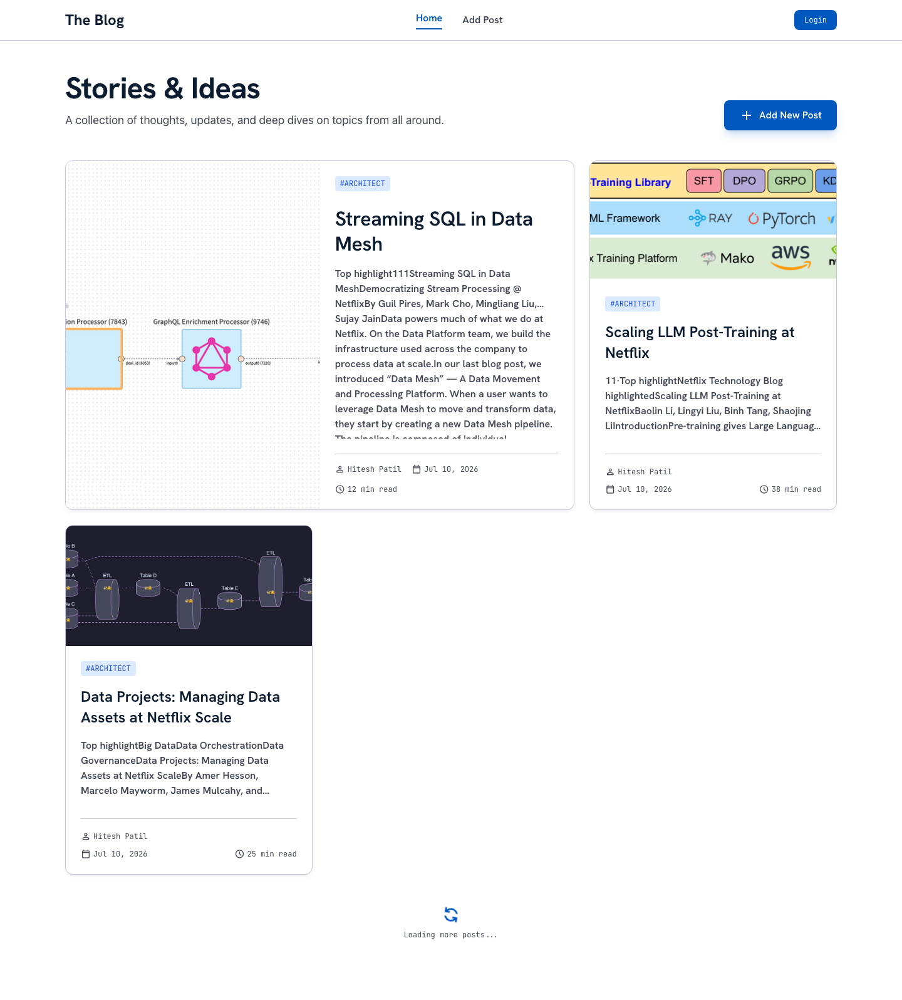
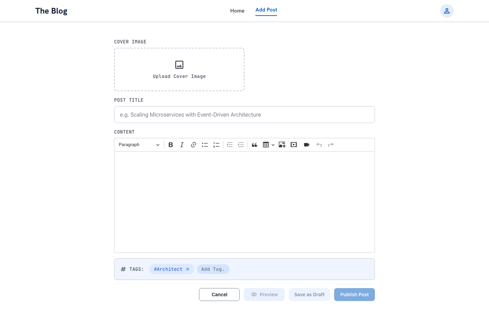
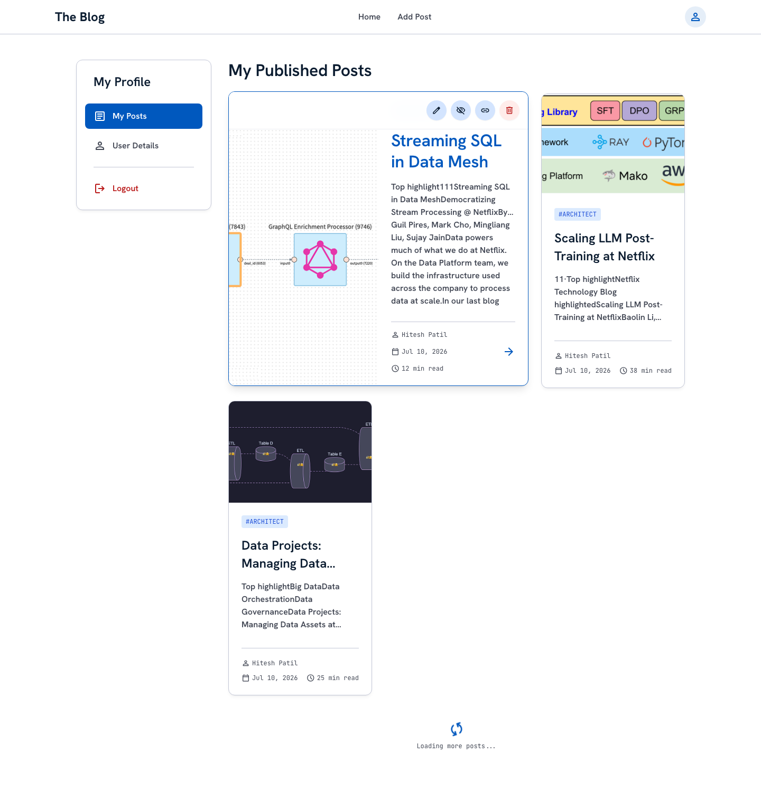

# Blog Posts Client

The frontend application for the full-stack blog platform.

## Overview
This is a modern React application bootstrapped with Vite, featuring a sleek, responsive design and a fully-featured rich text editor for creating blog posts.

## Live Demo
Check out the live production environment here: **[http://13.60.170.186](http://13.60.170.186)**

## Screenshots

<details>
<summary>Click to view Production Screenshots</summary>

### Home Page (Feed)


### Add Post (Rich Text Editor)


### User Profile (My Posts & Drafts)


</details>

## Approach
The frontend architecture emphasizes a premium user experience and efficient state management. We used **React** with **Vite** for fast HMR and optimized builds. **Apollo Client** was chosen to manage both local UI state and remote GraphQL data seamlessly, significantly reducing network payload by requesting only the needed fields.

Authentication state is managed globally via **`AuthContext`** (`src/context/AuthContext.jsx`), which fires a `me` GraphQL query on every page load to verify the session against the server. This ensures auth state is always sourced from the server (not stale `localStorage` values), and resolves the race condition that caused authenticated users to be redirected to login on page refresh. Sessions are maintained via **HTTP-only cookies** set by the server — the client never touches the token directly.

For content creation, we integrated **CKEditor 5** paired with a direct **Cloudinary** upload mechanism, allowing for rich media integration without burdening the backend servers. Styling was done using **Vanilla CSS**, relying on modern CSS variables, glassmorphism principles, and micro-animations to achieve a high-end feel without the bloat of heavy CSS frameworks.

## Tech Stack
- **React 19**: UI library
- **Vite**: Build tool and dev server
- **Apollo Client**: GraphQL state management and data fetching
- **CKEditor 5**: Rich text editing with image and video support
- **React Router DOM v7**: Client-side routing
- **Tailwind CSS**: Utility classes (dev only) + Vanilla CSS custom properties for design tokens
- **oxlint**: Fast linter (run with `npm run lint`)

## Prerequisites
Before you start, make sure you have created a Cloudinary account for media uploads (images and videos in posts).

You will need to set up the following environment variables in a `.env` file in the `client` root:
```env
VITE_API_URL=http://localhost:4000/graphql
VITE_CLOUDINARY_CLOUD_NAME=your_cloudinary_cloud_name
VITE_CLOUDINARY_UPLOAD_PRESET=your_upload_preset
```

> ⚠️ **Security:** The `.env` file is not currently listed in `.gitignore`. Add it before committing:
> ```bash
> echo ".env" >> .gitignore
> ```

**Production note:** In production, `VITE_API_URL` is set to `/graphql` (a relative path) in `.env.production`. This works because Nginx is configured to proxy `/graphql` to the server. Do not change this for production builds.

## Local Development

> **The client requires the server to be running first.** See the [blog-post-server](https://github.com/hitesh-patil/blog-post-server) README to start the API.

1. **Clone and install dependencies**
   ```bash
   git clone https://github.com/hitesh-patil/blog-post-client.git
   cd blog-post-client
   npm install
   ```

2. **Create your `.env` file** in the `client` root (see Prerequisites above for values).

3. **Start the dev server**
   ```bash
   npm run dev
   ```
   App runs at [http://localhost:5174](http://localhost:5174).

The client connects to the server at `VITE_API_URL` (default: `http://localhost:4000/graphql`). Cookies are scoped to `localhost` — both the client and server must run on `localhost` (not `127.0.0.1`) for cookies to be shared correctly in development.

## Available Scripts

In the project directory, you can run:

### `npm run dev`
Runs the app in the development mode.
Open [http://localhost:5174](http://localhost:5174) to view it in your browser.

### `npm run build`
Builds the app for production to the `dist` folder.
It correctly bundles React in production mode and optimizes the build for the best performance.

### Docker Setup
To run the client completely containerized via Docker:
```bash
docker-compose up --build
```
This builds a multi-stage Docker image (using Vite to build the static bundle and Nginx to serve it on port `8080`).

## Key Features
- **User Authentication**: Secure signup and login via HTTP-only cookie sessions. `AuthContext` verifies the session against the server on every page load — no stale local state.
- **Rich Text Editor**: Seamless integration with CKEditor 5 allowing media embeds, block quotes, text formatting, and direct Cloudinary uploads.
- **My Posts & Drafts**: Dedicated profile section to manage your published posts and drafts. You can edit, preview, unpublish, and delete posts from here.
- **Toast Notifications**: Non-blocking feedback toasts for post creation, update, and error events.
- **Responsive Layout**: Designed to work beautifully on both desktop and mobile devices.
